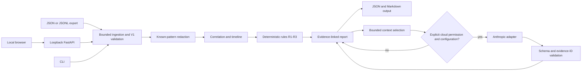

# Architecture

InvestigError accepts a versioned JSON or JSONL incident bundle through the CLI or local browser API. Both entry points use the same parser and analysis functions.

The input boundary rejects files over 2 MiB, more than 1,000 records, unknown fields, duplicate evidence IDs and invalid timestamps. The [contract guide](incident-format.md) links the generated input and report schemas. The [.NET and Python exporters](cross-language.md) produce this same contract; neither is part of the analyzer.

`ingestion.py` normalizes input; `redaction.py` masks recognized secrets and aliases sensitive identifiers; `correlation.py` relates records; `rules.py` emits findings only when its evidence requirements are met. `analysis.py` assembles the report. R1 requires a declared single-effect invariant and distinct committed effects. R2 requires a declared monotonic-version invariant plus local sequence/version evidence. R3 pairs a 2xx acknowledgement with a processing failure for the same delivery attempt. A missing downstream record remains an observation, not proof of failure.

The optional path uses `context.py` to select at most 100 records and 40,000 serialized characters while retaining cited evidence. `explanation.py` checks the structured response and selected evidence IDs. The provider interface in `providers/base.py` isolates the Anthropic SDK in `providers/anthropic.py`. A provider failure preserves the rules report with an explicit status. Citation validity establishes presence in the selected context, not semantic support. See [limitations](limitations.md).

`api.py` serves packaged static assets and examples on loopback. Raw upload bytes are capped before parsing. The browser previews the selected provider context and requires separate cloud consent. The server does not persist uploads or reports. The CLI writes JSON and Markdown to the requested output path. `evaluation.py` runs offline synthetic checks and an optional, separately authorized live comparison.
